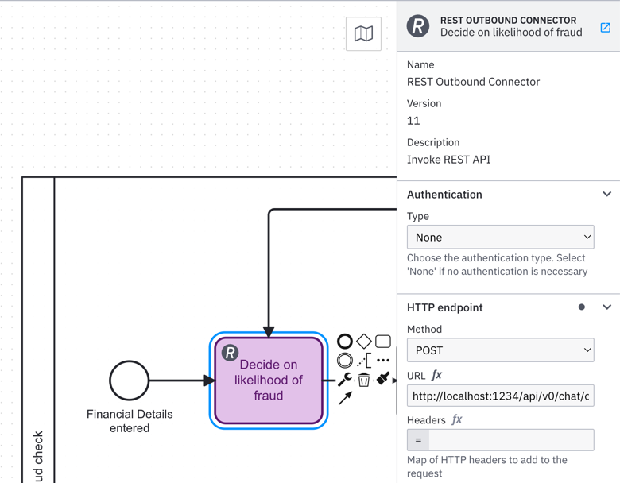
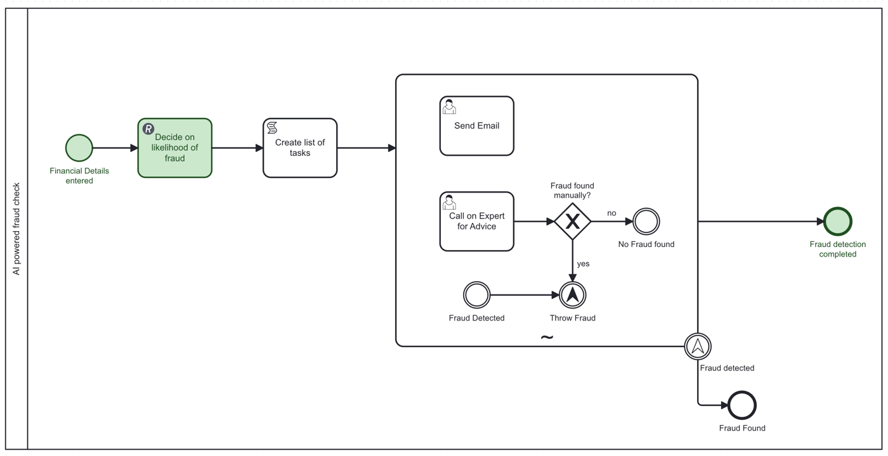
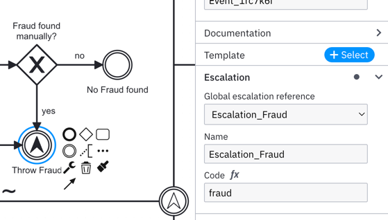
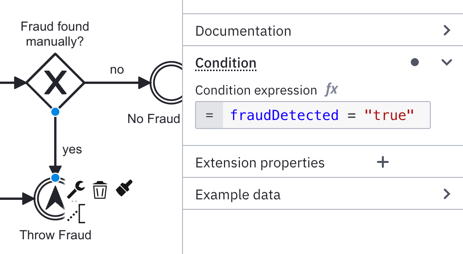

# Getting Started with Agentic Orchestration in Camunda 8
This repository provides a concise, practical guide to agentic orchestration with Camunda 8. It includes step-by-step instructions, 
code examples, and recommended practices to help you orchestrate intelligent agents with BPMN and the Camunda 8 stack.

## Table of Contents
- [Prerequisites](#prerequisites)
- [Starting up Camunda 8 Run](#starting-up-camunda-8-run)
- [Create and deploy a BPMN process](#create-and-deploy-a-bpmn-process)
  - [Start a process instance (Modeler Play)](#start-a-process-instance-modeler-play)
- [Integrate into an LLM](#integrate-into-an-llm)
  - [Option A: OpenAI Connector](#option-a-openai-connector)
  - [Option B: REST Outbound (LM Studio or custom)](#option-b-rest-outbound-lm-studio-or-custom)
  - [Map the result](#map-the-result)
  - [Deploy and test](#deploy-and-test)
  - [Troubleshooting (LLM integration)](#troubleshooting-llm-integration)
 - [Reacting on the LLM result](#reacting-on-the-llm-result)
   - [Normalize the LLM output (Script Task)](#normalize-the-llm-output-script-task)
   - [Drive an Ad-Hoc Subprocess from the list](#drive-an-ad-hoc-subprocess-from-the-list)
   - [Escalation for fraud detection](#escalation-for-fraud-detection)
   - [Add gateway conditions](#add-gateway-conditions)
   - [Deploy and test the reaction flow](#deploy-and-test-the-reaction-flow)

## Prerequisites
- OpenJDK 21–23: Required to run Camunda 8 Java components.
- Docker 20.10.21+: Required to run Camunda 8 via Docker Compose.
- [Camunda Desktop Modeler](https://camunda.com/download/modeler/): To model BPMN and DMN diagrams.
- If you are running Linux:
  - Ubuntu 22.04+ (Linux)
- [Camunda 8 Run](https://downloads.camunda.cloud/release/camunda/c8run/8.8/): Download the latest release for your OS/architecture. Extracting the `.tgz` creates a directory with the `camunda-run` scripts.
- LLM access: [LM Studio](https://lmstudio.ai/) with a local LLM of your choice, or access to the OpenAI API or Google Gemini.

## Starting up Camunda 8 Run
Follow these steps to start Camunda 8 Run locally or via Docker using C8Run.

1) Extract and navigate to the C8Run folder
- After downloading the archive, extract it. A folder containing the `camunda-run`/`c8run` scripts will be created.
- Open a terminal and change into that folder (often named like `c8run-<version>`).

2) Start locally (no Docker)
- macOS/Linux (helper script):
  ```
  ./start.sh
  ```
- macOS/Linux (CLI):
  ```
  ./c8run start
  ```
- Windows (PowerShell or CMD):
  ```
  .\c8run.exe start
  ```

When startup completes, Operate should open automatically. If it doesn’t, navigate to:
http://localhost:8080/operate

3) Start with Docker Compose
This uses Docker Compose and is equivalent to `docker compose up -d` for the Camunda 8 stack managed by C8Run.

When started with Docker, access Operate at:
http://localhost:8088/operate

4) Stop services
- Local:
  ```
  ./c8run stop
  ```
- Docker:
  ```
  docker compose down
  ```

## Create and deploy a BPMN process
Follow these steps to model and deploy a minimal process from the Camunda Desktop Modeler.

1) Create a new BPMN diagram
- Open the Camunda Desktop Modeler and choose “New File” → “BPMN Diagram (Camunda 8)”.
- Set the process properties:
  - Name: `AI Fraud Check`
  - Process Id: `ai-fraud-check`

2) Model a minimal flow
- Add a Start Event and an End Event, connected by a sequence flow.
- Optionally rename the events to `Fraud Check Requested` and `Fraud Check Completed` (see screenshot below).

3) Save the diagram
- Save as `ai-fraud-check.bpmn` in your workspace folder.

**Reference diagram and interface of the Camunda Desktop Modeler:**


4) Configure the deployment target
- Click the “Deploy” rocket icon in the bottom-left.
- In the deploy panel, select “Self-Managed”.
- Gateway address (Zeebe): `http://localhost:26500`
  - Works for both local C8Run and C8Run with Docker Compose (port 26500 is exposed).

5) Deploy
- Click “Deploy”. You should see a success message when deployment completes.

6) Verify the deployment
- Open Operate:
  - Local C8Run: http://localhost:8080/operate
  - Docker Compose: http://localhost:8088/operate
- In Operate, open “Processes” and confirm that `AI Fraud Check` is shown as deployed.

### Start a process instance
Use the Camunda Modeler’s Play button to start an instance of `ai-fraud-check` with an agreed test payload.

1) Click the “Play” button (▶) next to the Deploy icon.
2) Ensure Process Id is `ai-fraud-check`. Optionally set a Business Key.
3) Paste the following JSON into the Variables field:

```json
{
  "fullName": "Maria Heinrichs",
  "dob": "2023-06-08",
  "emailAddress": "thomas.heinrichs@miragon.io",
  "totalIncome": 10000,
  "totalExpenses": 640000,
  "largePurchases": ["House"],
  "charitableDonations": "Rotes Kreuz - 60 Euro im Jahr"
}
```

Notes
- For consistency across this guide, only use the variables listed above unless explicitly instructed otherwise.
- Ensure the JSON is valid (double quotes around keys/strings, no trailing commas).

4) Click “Start instance”. The process should start and complete immediately for this minimal flow.

Verify in Operate
- Open Operate and search for the process. If you don’t see the instance, enable “Include Completed”.
- You should see a completed instance of `AI Fraud Check`.

Troubleshooting
- Deployment fails: ensure Camunda 8 Run is started and reachable on `http://localhost:26500`.
- Wrong diagram type: create a “BPMN Diagram (Camunda 8)” and select “Self-Managed” as the target.
- Cannot start instance: verify the Process Id is `ai-fraud-check` and the variables JSON is valid.

**Congratulations! You have successfully created, deployed, and started your first process in Camunda 8.**

## Integrate into an LLM
In this step, you will call an LLM from your process. You can either:
- Use the OpenAI Connector (best for OpenAI API and compatible providers), or
- Use the REST Outbound Connector (works with LM Studio).

During the workshop you will receive API credentials if needed. If you use LM Studio, start its local server and note the base URL (default: `http://localhost:1234/api/v0/chat/completions`).

Add a Service Task to your BPMN and apply one of the connector options below.


### Option A: OpenAI Connector
Best for OpenAI API. In the Service Task properties, select a outbound Connector: OpenAI.

Recommended fields:
- Authentication: set your API Key (store as a secret if possible).
- Model: `gpt-4o-mini` (or any available model in your account).
- Messages:
  - System message:
    - Content (FEEL expression):
      `= "You are a fraud assistant. Return only one or more of: email,human,fraud (comma-separated, lowercase)."`
  - User message:
    - Content (FEEL expression using process variables):
      `= "Evaluate potential fraud for " || fullName || " (DOB " || dob || "). Total Income " || string(totalIncome) || 
      ", Total Expenses " || string(totalExpenses) || ", Charitable Donations " || charitableDonations || 
      ", Large purchases: " || string(join(largePurchases, ", "))`
- Temperature: `0.2`


### Option B: REST Outbound 
Use this when calling LM Studio's HTTP API.

Request configuration:
- Method: `POST`
- URL: `http://localhost:1234/v1/chat/completions`
- Headers:
  - `Content-Type: application/json` 
- Body (FEEL or JSON with embedded FEEL):
```json
{
  "model": "qwen2.5-7b-instruct",
  "messages": [
    {"role": "system", "content": "You are a fraud assistant. Return only: email,human,fraud (comma-separated)."},
    {"role": "user", "content": "Evaluate potential fraud for ${fullName} (DOB ${dob}). Total Income ${totalIncome}, Total Expenses ${totalExpenses}, Charitable Donations ${charitableDonations}, Large purchases: ${join(largePurchases, ', ')}"}
  ],
  "temperature": 0.2,
  "stream": false
}
```

### Map the result
Map the LLM response to a process variable so you can inspect it in Operate or use it later in the flow.

```
{response: response.body}
```

### Deploy and test
1) Deploy the updated process.
2) Start a new instance using the same JSON payload from the previous section.
3) In Operate, open the instance → Variables. You should see `response` containing the LLM’s decision, for example: `"email,human"` or `"fraud"`.

### Troubleshooting (LLM integration)
- 401/403 Unauthorized: Check the API key/secret configuration.
- Connection refused: Ensure LM Studio’s server is running and the URL/port is correct (`/v1/chat/completions`).
- Model not found: Use a model name that exists locally (LM Studio) or in your provider account.
- Invalid JSON body: Validate FEEL expressions and quotes in the request body

## Reacting on the LLM result
Now let’s extend the process to react to the LLM decision. We will:
- Normalize the LLM text into a list variable `tasks`.
- Use an Ad‑Hoc Subprocess to run the matching actions `human`, `email`, and/or `fraud`.
- Detect fraud with a boolean `fraudDetected` and route with an Exclusive Gateway.
- Model an escalation end for fraud and catch it at the parent scope.

Here is the target blueprint of the flow:


Notes
- This section assumes the LLM’s decision text is stored in variable `response` (e.g., `"email,human"` or `"fraud"`). 

### Normalize the LLM output (Script Task)
Add a Script Task named “Create List of Tasks”. We’ll convert the comma‑separated string into a clean list and also compute a fraud flag.

Result variables is set to: `tasks`
```
{
  "split(response, ",")"
}
```

Explanation
- `tasks` becomes a list like `["email", "human"]` or `["fraud"]`.

### Drive an Ad-Hoc Subprocess from the list
Add an Ad‑Hoc Subprocess after the Script Task.

Inside the Ad‑Hoc Subprocess, add three activities (or start points) representing possible actions:
- An activity with ID `human` for a User Task (human in the loop: approve/reject).
- An activity with ID `email` for sending a notification email (can be a placeholder User Task for now).
- An activity with ID `fraud` that will end in an Escalation Event (see next subsection).

Configure the Ad‑Hoc Subprocess:
- Collection of active elements: set to `tasks`.
- Matching rule: items in `tasks` must match the activity IDs above. Ensure the activity IDs are exactly `human`, `email`, `fraud`.

Tip
- For the human review User Task, you can add a simple boolean variable `fraudDetected` that the user sets; you can use it in subsequent routing as needed.

### Escalation for fraud detection
If fraud is detected, we want to end the process through an escalation.

Steps
1) Create a global Escalation reference (e.g., Name `FraudDetected`, Code `fraud`).
2) In the `fraud` path inside the Ad‑Hoc Subprocess, add an Escalation End Event referencing the same escalation.
3) On the boundary of the parent subprocess or the enclosing activity, attach an Escalation Boundary Event that references the same global escalation.

Reference


### Add gateway conditions
Add an Exclusive Gateway with two outgoing sequence flows:
- Flow A (fraud): Expression
  ```
  fraudDetected = true
  ```
- Flow B (no fraud): Expression
  ```
  not(fraudDetected)
  ```

Reference


### Deploy and test the reaction flow
1) Deploy the updated process definition.
2) Start an instance with the same JSON variables as before.
3) In Operate, inspect Variables after the Script Task:
   - `tasks` should be a list (e.g., `["email","human"]`).
   - `fraudDetected` should be `true` when `tasks` contains `"fraud"`.
4) Verify behavior:
   - When `response = "fraud"`, the escalation flow is taken.
   - When `response` includes `human`, the User Task appears; complete it to continue.
   - When `response` includes `email`, the email activity executes (placeholder if not fully implemented).


 